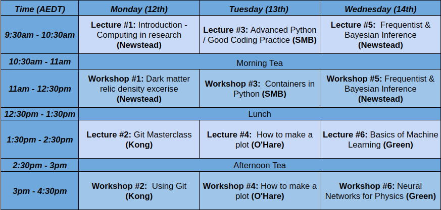

# CDM Computing Subgroup: 

## Organisation Team

### Lead:
- Matthew Green (UoA)
- Jayden Newstead (UoM)

### Local: 
- Stephan Meighan-Berger  (UoM)
- Ellen Sirks (USyd)
- Lindsey Bignell (ANU)
- Ben McAllister (Swin)
- Maxim Goryachev (UWA)

## Schedule 

## Recordings:

### Day 1:

Passcode: q.FC0T@c

[Introduction and DM Freeze out and Relic Density](https://adelaide.zoom.us/rec/share/OSH8d-fGRjz0oI_5UatudlGBzUgBEaCpTPABVKWN0WNOINt4DTg5sasihmhQYGbK.N8o19cYNbkH6Xxh-?startTime=1707691280000)

[Git Part 1](https://adelaide.zoom.us/rec/share/OSH8d-fGRjz0oI_5UatudlGBzUgBEaCpTPABVKWN0WNOINt4DTg5sasihmhQYGbK.N8o19cYNbkH6Xxh-?startTime=1707705092000)

[Git Part 2](https://adelaide.zoom.us/rec/share/OSH8d-fGRjz0oI_5UatudlGBzUgBEaCpTPABVKWN0WNOINt4DTg5sasihmhQYGbK.N8o19cYNbkH6Xxh-?startTime=1707710440000)

### Day 2:

Passcode: &dy1+ZkZ

[Advanced Python / Containers Part 1](https://adelaide.zoom.us/rec/share/mprh8Oeg4LTqUnwUtDIfhLSZGQhdp3XkoT6SpJVU3luPF_Ud0Aj32RNywFPNvFWX.hjCIg2Qe3D5KyPFY?startTime=1707777433000)

[Advanced Python / Containers Part 2](https://adelaide.zoom.us/rec/share/mprh8Oeg4LTqUnwUtDIfhLSZGQhdp3XkoT6SpJVU3luPF_Ud0Aj32RNywFPNvFWX.hjCIg2Qe3D5KyPFY?startTime=1707782486000)

[Plotting Part 1](https://adelaide.zoom.us/rec/share/mprh8Oeg4LTqUnwUtDIfhLSZGQhdp3XkoT6SpJVU3luPF_Ud0Aj32RNywFPNvFWX.hjCIg2Qe3D5KyPFY?startTime=1707791439000)

[Plotting Part 2](https://adelaide.zoom.us/rec/share/mprh8Oeg4LTqUnwUtDIfhLSZGQhdp3XkoT6SpJVU3luPF_Ud0Aj32RNywFPNvFWX.hjCIg2Qe3D5KyPFY?startTime=1707796850000)

### Day 3:

Passcode: d=F!71pR

[Bayesian and Frequentist Inference Part 1](https://adelaide.zoom.us/rec/share/94xW5KkerelIH1eN2U0_I_Y4VtvjY0H2BNxmITFqwh9iAhI8P1rkFc8MdWN8vJXr.hXDyFyPUpiiFn_8R?startTime=1707864102000)

[Bayesian and Frequentist Inference Part 2](https://adelaide.zoom.us/rec/share/94xW5KkerelIH1eN2U0_I_Y4VtvjY0H2BNxmITFqwh9iAhI8P1rkFc8MdWN8vJXr.hXDyFyPUpiiFn_8R?startTime=1707868898000)

[Introduction to Machine Learning Part 1](https://adelaide.zoom.us/rec/share/94xW5KkerelIH1eN2U0_I_Y4VtvjY0H2BNxmITFqwh9iAhI8P1rkFc8MdWN8vJXr.hXDyFyPUpiiFn_8R?startTime=1707878017000)

[Introduction to Machine Learning Part 2](https://adelaide.zoom.us/rec/share/94xW5KkerelIH1eN2U0_I_Y4VtvjY0H2BNxmITFqwh9iAhI8P1rkFc8MdWN8vJXr.hXDyFyPUpiiFn_8R?startTime=1707883244000)

[Conclusion](https://adelaide.zoom.us/rec/share/94xW5KkerelIH1eN2U0_I_Y4VtvjY0H2BNxmITFqwh9iAhI8P1rkFc8MdWN8vJXr.hXDyFyPUpiiFn_8R?startTime=1707888454000)

